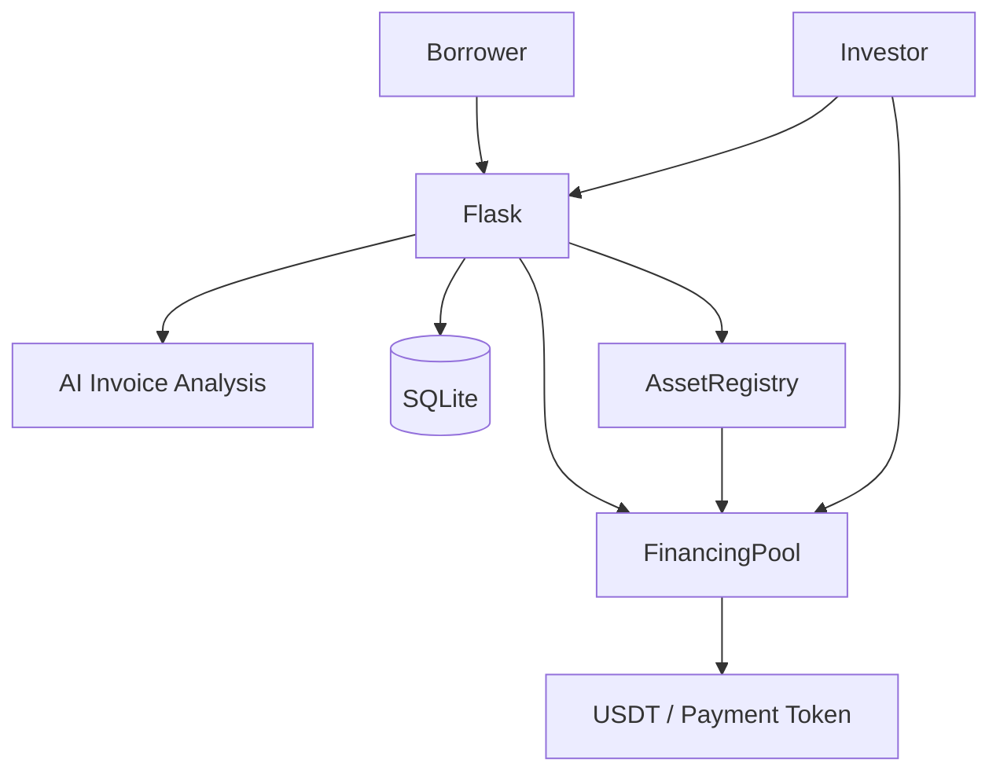

# AssetFlow

**AI-Powered RWA Invoice Financing on BOT Chain**

AssetFlow transforms verified invoices into investable on-chain assets. Borrowers upload invoice documents, AI extracts and verifies the data, and the resulting financing opportunity is registered on BOT Chain. Investors can then fund these assets through the on-chain `FinancingPool`, with every funding transaction recorded as an `AssetFunded` event and persisted locally for auditability.

This repository contains a live BOT Chain Testnet deployment, production-hardened token handling, and a full-stack implementation ready for Mainnet deployment.

---

## Problem

Businesses with valid invoices often wait weeks or months for payment. Traditional invoice financing introduces slow underwriting, fragmented verification, limited investor access, high friction, opaque funding records, and inefficient settlement. AssetFlow addresses these issues by combining AI-powered document analysis with transparent on-chain financing.

---

## Solution

1. **Borrower uploads** an invoice document (PDF, PNG, JPG).
2. **AI extraction** analyzes the document and extracts invoice fields.
3. **Verification** validates invoice eligibility (dates, amounts, currency, completeness).
4. **Financing preparation** converts the invoice into an on-chain payload with exact token-decimal arithmetic.
5. **BOT Chain registration** creates the asset via `AssetRegistry`.
6. **Investor marketplace** displays listed and partially funded assets with live on-chain funding state.
7. **BOT Chain funding** investors submit funding through `FinancingPool.fund()`.
8. **On-chain evidence** the `AssetFunded` event provides immutable funding proof.
9. **Local persistence** the application stores `Investment` and `BlockchainTransaction` records for operational auditability.

---

## Why BOT Chain

BOT Chain is not a cosmetic integration. AssetFlow uses BOT Chain as the settlement and identity layer for the entire financing lifecycle:

```text
Asset Registration
        ↓
BOT Chain AssetRegistry
        ↓
Investor Funding
        ↓
BOT Chain FinancingPool
        ↓
AssetFunded Event
        ↓
Local Investment / Transaction Persistence
```

### AssetRegistry

Registers the on-chain identity of each invoice financing asset, including originator, face value, financing target, maturity timestamp, risk score, and status transitions.

### FinancingPool

Receives investor funding against registered assets, tracks per-investor balances, enforces financing caps, and emits `AssetFunded` and `FundingCompleted` events. It also handles repayments and pro-rata return claims.

### Contract Relationship

`FinancingPool` is constructed with the payment token and `AssetRegistry` addresses. `AssetRegistry` is then configured with the `FinancingPool` address so the two contracts can coordinate status transitions and repayment confirmations.

---

## AI Component

AssetFlow includes an AI document-extraction pipeline that processes uploaded invoices and returns structured data such as invoice number, face value, currency, issue date, and due date. The extracted data feeds directly into the verification and financing preparation stages. Risk scores are also generated and stored as part of the asset metadata. The AI layer is pluggable and currently supports mock, AgentRouter, OpenAI, and OpenRouter providers.

---

## RWA Lifecycle

```text
Invoice
   ↓
Document Processing (PDF / image)
   ↓
AI Extraction
   ↓
Verification
   ↓
Financing Preparation
   ↓
BOT Chain Asset Registration
   ↓
Investor Marketplace
   ↓
BOT Chain Funding
   ↓
AssetFunded
   ↓
Investment Persistence
```

---

## Investor Funding Flow

1. **Authentication** — investors authenticate via wallet-based challenge/response.
2. **Authorization** — the application enforces `INVESTOR` role access.
3. **Dashboard** — investors browse listed and partially funded assets with live on-chain totals and remaining capacity.
4. **Asset Detail** — each asset shows financing target, amount funded, remaining funding, and token symbol.
5. **Funding Input** — the investor enters an amount. The UI uses `step="0.000001"` to support 6-decimal payment tokens.
6. **Decimal Conversion** — the amount is converted to base units using exact `Decimal` arithmetic and the configured `PAYMENT_TOKEN_DECIMALS`.
7. **Transaction** — `FinancingPool.fund()` executes on BOT Chain.
8. **Persistence** — on success, the application creates `Investment` and `BlockchainTransaction` records keyed by transaction hash and event `logIndex`.

---

## BOT Chain Testnet Deployment

**Network:** BOT Chain Testnet  
**Chain ID:** `968`  
**Explorer:** https://scan.bohr.life  

**Payment Token:** USDT  
**Payment Token Decimals:** `6`

**AssetRegistry:**  
`0x30179Fe77Da4CDA73df824C65DF39F733864A8A7`

**FinancingPool:**  
`0x7a4C69AE659eFFEdcCb631236a5Dc6E9673f4fF9`

**Payment Token:**  
`0x75edC9335175Fc0552D51D48439F229c10420fe`

### Testnet Smoke Test Evidence

#### Asset creation

**Status:** PASS  
**On-chain asset ID:** `3`  
**Transaction:** https://scan.bohr.life/tx/0x4686222c1b7f84028c273c6d75cc187153ae0852ab107599c931113716ffd58b

#### Funding

**Status:** PASS  
**Funding amount:** `50.00 USDT`  
**Financing target:** `80.00 USDT`  
**Total funded:** `50.00 USDT`  
**Remaining funding:** `30.00 USDT`  
**AssetFunded event:** PASS  
**Event logIndex:** `1`  
**Transaction:** https://scan.bohr.life/tx/0xc8d4e1789fb90909519393f12cb57cd1ec976673e8dd6ad697162b53e7c8291e

#### Local persistence

**Investment:** PASS  
**BlockchainTransaction:** PASS

The smoke test demonstrates the complete path:

```text
Investor Funding
      ↓
BOT Chain transaction
      ↓
AssetFunded event
      ↓
Transaction metadata
      ↓
Investment persistence
      ↓
BlockchainTransaction persistence
```

---

## Smart Contract Architecture

### AssetRegistry.sol

- `createAsset` — registers a new RWA asset with originator, face value, financing target, maturity, and risk score.
- `setFinancingPool` — authorizes the FinancingPool contract (owner only).
- `updateAssetStatus` — advances assets through the financing lifecycle.
- `cancelAsset` — cancels an asset (owner or FinancingPool).
- `confirmRepaid` — called by FinancingPool when repayment is received.
- Events: `AssetCreated`, `AssetStatusUpdated`, `AssetVerified`, `AssetCancelled`.

### FinancingPool.sol

- `fund` — investors fund a listed or partially funded asset with ERC20 payment tokens.
- `repay` — the originator repays the financing.
- `claim` — investors claim pro-rata returns after repayment.
- `pause` / `unpause` — emergency controls (owner only).
- Events: `AssetFunded`, `FundingCompleted`, `RepaymentReceived`, `ReturnsClaimed`.

### MockUSDT.sol

Local ERC20 mock for Hardhat testing only. Do not use on BOT Chain Mainnet.

### Deployment Order

```text
Deploy AssetRegistry
        ↓
Deploy FinancingPool
        ↓
Configure AssetRegistry.financingPool
        ↓
Verify contract relationships
```

---

## Architecture



### Key Directories

```text
assetflow/
├── auth/                  # Wallet-based authentication
├── borrower/              # Borrower routes and templates
├── investor/              # Investor routes and templates
├── database/              # SQLAlchemy models, enums, state machine
├── services/              # Blockchain clients, financing orchestration, AI, token decimals
├── templates/             # Jinja2 HTML templates
├── blockchain/
│   ├── contracts/         # Solidity smart contracts
│   ├── scripts/           # deploy.js, verify.js
│   └── test/              # Hardhat test suite
├── tests/                 # Python pytest suite
├── app.py                 # Flask application factory
├── config.py              # Environment-driven configuration
├── requirements.txt       # Python dependencies
└── .env.example           # Environment variable template
```

---

## Security and Production Hardening

Application-level production hardening has been implemented across the stack:

- `.env` is gitignored; secrets are never committed.
- Deployment artifacts (`blockchain/deployments/`) are gitignored.
- Private keys, RPC URLs, Authorization headers, and Bearer tokens are sanitized from application error messages and logs.
- Investor and borrower routes enforce role-based authentication.
- Deployment scripts validate network names, chain IDs, and required environment variables before sending transactions.
- BOT Chain Mainnet deployment requires explicit opt-in via `CONFIRM_BOTCHAIN_MAINNET_DEPLOY=YES`.
- Token conversion uses exact `Decimal` arithmetic; no floating-point math is used for funding amounts.
- Excessive decimal precision is rejected rather than silently rounded.
- Testnet smoke tests are gated behind `RUN_BOTCHAIN_TESTNET_SMOKE=1` so they are not accidentally executed.

> Application-level production hardening implemented; no formal third-party security audit has been performed.

---

## Token Decimal Handling

All human-readable token amounts flow through a strict conversion pipeline:

```text
Human amount (Decimal)
        ↓
to_base_units()
        ↓
uint256 base units
        ↓
ERC-20 transfer
```

Token decimals are configuration-driven via `PAYMENT_TOKEN_DECIMALS`. For the BOT Chain Testnet deployment, the configured payment token uses **6 decimals**:

```text
50.00 USDT
↓
6 decimals
↓
50,000,000 base units
```

Excessive precision is rejected:

```text
0.0000001 USDT with 6 decimals
↓
rejected (cannot be represented exactly)
```

No hardcoded `10**18` assumptions exist in the production funding path.

---

## Testing

### Python

```bash
pytest -q
```

**330 passed, 4 skipped**

Skipped tests are gated live BOT Chain smoke tests requiring `RUN_BOTCHAIN_TESTNET_SMOKE=1`.

### Hardhat

```bash
cd blockchain
npm test
```

**68 passing**

### Coverage Areas

- Authentication and wallet challenge/response
- Borrower routes (upload, document processing, extraction, verification)
- Investor routes (dashboard, asset detail, funding)
- Asset registry client
- Financing pool client
- Financing preparation, submission, and funding orchestration
- Token decimal conversion
- Configuration safety
- BOT Chain smoke-test infrastructure
- Solidity deployment guards
- Secret sanitization

---

## Project Structure

```text
assetflow/
├── auth/                    # Wallet-based authentication (challenge, signature verification)
├── borrower/                # Borrower blueprint (upload, asset management, financing submission)
├── investor/                # Investor blueprint (dashboard, asset detail, funding)
├── database/                # SQLAlchemy models, enums, state machine
├── services/                # Core business logic
│   ├── asset_registry_client.py     # BOT Chain AssetRegistry interaction
│   ├── financing_pool_client.py     # BOT Chain FinancingPool interaction
│   ├── financing_preparation.py     # Invoice → on-chain payload conversion
│   ├── financing_submission.py      # Asset creation orchestration
│   ├── financing_funding.py         # Funding orchestration and validation
│   ├── token_decimals.py            # Exact Decimal-based token conversion
│   ├── invoice_verification.py      # Invoice eligibility checks
│   ├── document_processing.py       # PDF/image processing
│   ├── invoice_pipeline.py          # AI extraction orchestration
│   └── ai_provider.py               # Pluggable AI provider (mock, AgentRouter, OpenAI, OpenRouter)
├── templates/
│   ├── base.html            # Shared layout
│   ├── borrower/            # Borrower-facing pages
│   └── investor/            # Investor-facing pages
├── blockchain/
│   ├── contracts/           # Solidity source (AssetRegistry, FinancingPool, MockUSDT)
│   ├── scripts/             # deploy.js, verify.js
│   ├── test/                # Hardhat test suite
│   └── README.md            # Blockchain-specific documentation
├── tests/                   # Python pytest suite
├── app.py                   # Flask application factory
├── config.py                # Environment-driven configuration
├── requirements.txt         # Python dependencies
├── .env.example             # Environment variable template
└── .gitignore               # Git ignore rules
```

---

## Local Development

### Prerequisites

- Python 3.10+
- Node.js 18+ (for smart contract development)
- Git

### Python environment

```bash
# Windows (PowerShell)
python -m venv .venv
.\.venv\Scripts\Activate.ps1

# Git Bash / Linux / macOS
python -m venv .venv
source .venv/bin/activate
```

### Install Python dependencies

```bash
pip install -r requirements.txt
```

### Configure environment

```bash
# Windows (PowerShell)
Copy-Item .env.example .env

# Git Bash / Linux / macOS
cp .env.example .env
```

Edit `.env` and fill in the required values. **Never commit `.env`.**

### Run Flask application

```bash
flask run
```

The application will be available at `http://127.0.0.1:5000`.

---

## Smart Contract Development

### Install dependencies

```bash
cd blockchain
npm install
```

### Available commands

| Command | Description |
|---|---|
| `npm run compile` | Compile Solidity contracts |
| `npm test` | Run Hardhat test suite |
| `npm run test:coverage` | Run Hardhat coverage |
| `npm run deploy` | Deploy to local Hardhat network |
| `npm run deploy:bot` | Deploy to BOT Chain (requires `BOT_CHAIN_NETWORK_NAME=botchain`) |
| `npm run verify` | Verify deployment record against on-chain contracts |

---

## BOT Chain Deployment

### Required environment variables

```env
BOT_CHAIN_RPC_URL=https://rpc.bohr.life
BOT_CHAIN_CHAIN_ID=968
BOT_CHAIN_NETWORK_NAME=BOT Chain Testnet
BOT_CHAIN_EXPLORER_URL=https://scan.bohr.life/
BOT_CHAIN_NATIVE_CURRENCY=BOT
PRIVATE_KEY=0x...
PAYMENT_TOKEN_ADDRESS=0x...
PAYMENT_TOKEN_DECIMALS=6
```

### Mainnet safety gate

BOT Chain Mainnet deployment is intentionally fail-closed. To deploy to Mainnet (chain ID `677`), you must explicitly set:

```env
CONFIRM_BOTCHAIN_MAINNET_DEPLOY=YES
```

Without this flag, the deployment script will refuse to send transactions to Mainnet.

### Deployment record

The deployment script writes public metadata to `blockchain/deployments/<network>.json`. This file contains only public information:

- network name
- chain ID
- deployer address
- AssetRegistry address
- FinancingPool address
- payment token address
- payment token decimals
- deployment timestamp

Private keys, RPC credentials, authorization headers, and bearer tokens are never written to deployment artifacts.

---

## Mainnet Status

| Network | Status |
|---|---|
| BOT Chain Testnet | LIVE — deployed and smoke-tested |
| BOT Chain Mainnet | NOT YET DEPLOYED |

Mainnet deployment requires:

- Mainnet RPC URL and chain ID (`677`)
- Mainnet payment token address (not MockUSDT)
- Correct payment token decimals for the Mainnet token
- Funded deployer wallet with BOT for gas
- Explicit `CONFIRM_BOTCHAIN_MAINNET_DEPLOY=YES`
- Final human verification of all contract addresses before any transaction

---

## BOT Chain Builder Challenge #2

### RWA Applications

AssetFlow turns real-world invoices into financing assets and connects them to an on-chain financing lifecycle on BOT Chain.

### AI Native Applications

AI is used to extract and analyze invoice information as part of the financing workflow, reducing manual underwriting effort and enabling faster investor decisions.

### BOT Chain Mainnet Integration

The architecture is specifically designed around BOT Chain's `AssetRegistry` and `FinancingPool` contracts. The current verified deployment is on BOT Chain Testnet; Mainnet deployment is the final deployment stage.

---

## Future Development

- BOT Chain Mainnet deployment
- Broader investor liquidity and order book functionality
- Additional RWA asset types beyond invoices
- Enhanced AI underwriting and risk scoring
- Richer investor analytics and portfolio tracking
- Repayment lifecycle and automated settlement
- Production wallet integration (MetaMask, WalletConnect)
- Additional compliance and risk controls

---

## License

License information will be added separately.
